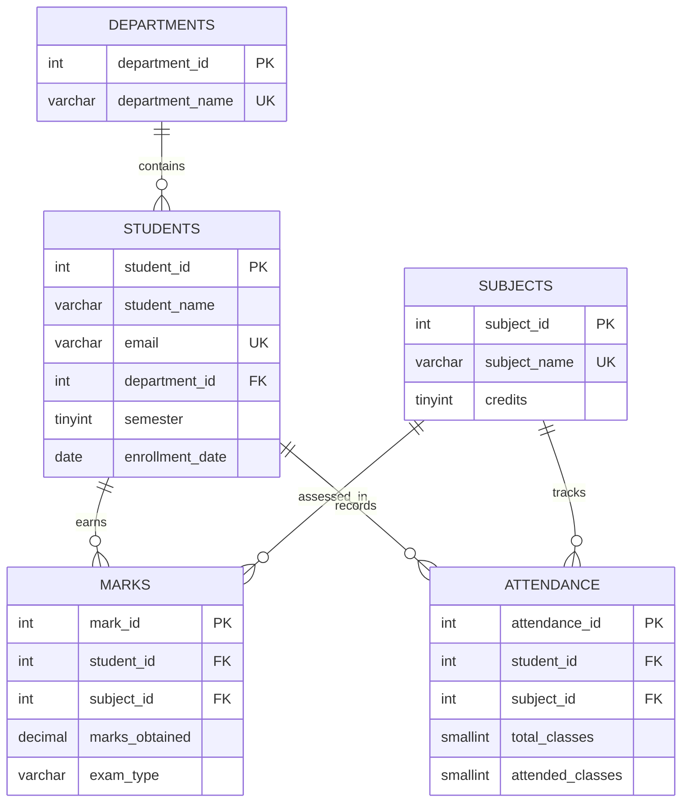

# Entity Relationship Diagram

```mermaid
erDiagram
    DEPARTMENTS ||--o{ STUDENTS : contains
    STUDENTS ||--o{ MARKS : earns
    SUBJECTS ||--o{ MARKS : assessed_in
    STUDENTS ||--o{ ATTENDANCE : records
    SUBJECTS ||--o{ ATTENDANCE : tracks

    DEPARTMENTS {
        int department_id PK
        varchar department_name UK
    }
    STUDENTS {
        int student_id PK
        varchar student_name
        varchar email UK
        int department_id FK
        tinyint semester
        date enrollment_date
    }
    SUBJECTS {
        int subject_id PK
        varchar subject_name UK
        tinyint credits
    }
    MARKS {
        int mark_id PK
        int student_id FK
        int subject_id FK
        decimal marks_obtained
        varchar exam_type
    }
    ATTENDANCE {
        int attendance_id PK
        int student_id FK
        int subject_id FK
        smallint total_classes
        smallint attended_classes
    }
```
